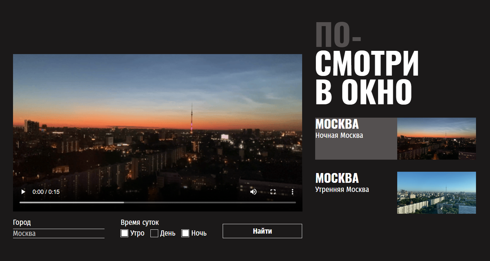

<h1>Посмотри в окно</h1>

<h2>Описание</h2>

Одностраничный сайт для большого монитора. Сверстан под ширину экрана минимум 1200px.

Проделана работа с частично готовым модулем. Прописано CSS для работающего приложения.

Функционал:

<ul>
  <li>поиск видео городов в разное время суток;</li>
  <li>отображение результата в блоке с видео и в списке карточек справа;</li>
  <li>пока идет поиск, в блоки с видео и карточками подставляются прелоадеры, отображающие анимацию процесса загрузки;</li>
  <li>в случае ошибок на место блока с видео подставляется блок с сообщением об ошибке.</li>
</ul>
<h2>Технологии</h2>
<ul>
  <li>CSS:
    <ul>
      <li>flexbox;</li>
      <li>логические свойства;</li>
      <li>псевдоклассы (has, hover, active, focus, focus-visible);</li>
      <li>псевдоэлементы (after);</li>
      <li>стилизация элементов форм.</li>
    </ul>
  </li>
</ul>
<h2>Ссылка на макет</h2>
<a href="https://www.figma.com/file/QHcvX1RsUI89CulRB7HLk6/%234-Посмотри-в-окно?node-id=0%3A1&t=tJOMMSaw5EIu481X-1">Открыть</a>
<h2>Ссылка на проект</h2>
<a href="https://juliadik.github.io/posmotri_v_okno/index.html">Открыть</a>